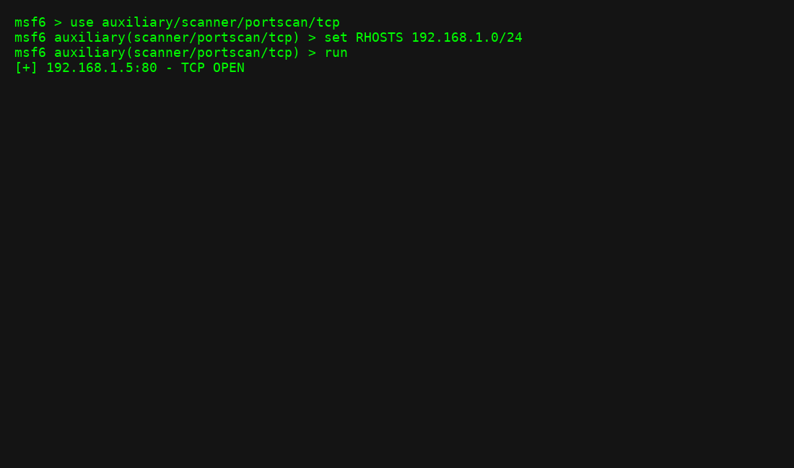

# Intro to Metasploit

This lab walks through starting Metasploit and using a simple auxiliary module.

## Command Used
```bash
msfconsole
use auxiliary/scanner/portscan/tcp
set RHOSTS 192.168.1.0/24
run
```

## Output
```
[*] Scanning 192.168.1.0/24...
[+] 192.168.1.5:80 - TCP open
```



## Lessons Learned
- Metasploit modules are powerful for reconnaissance.
- RHOSTS specifies the target IP range.
